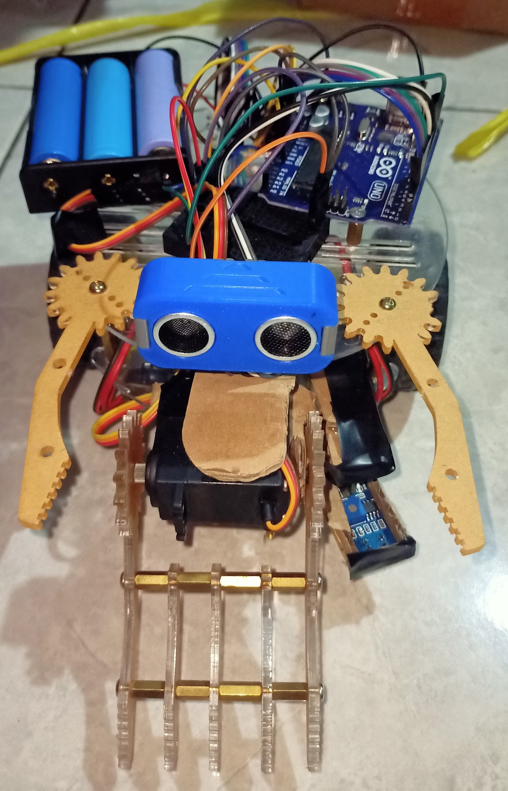
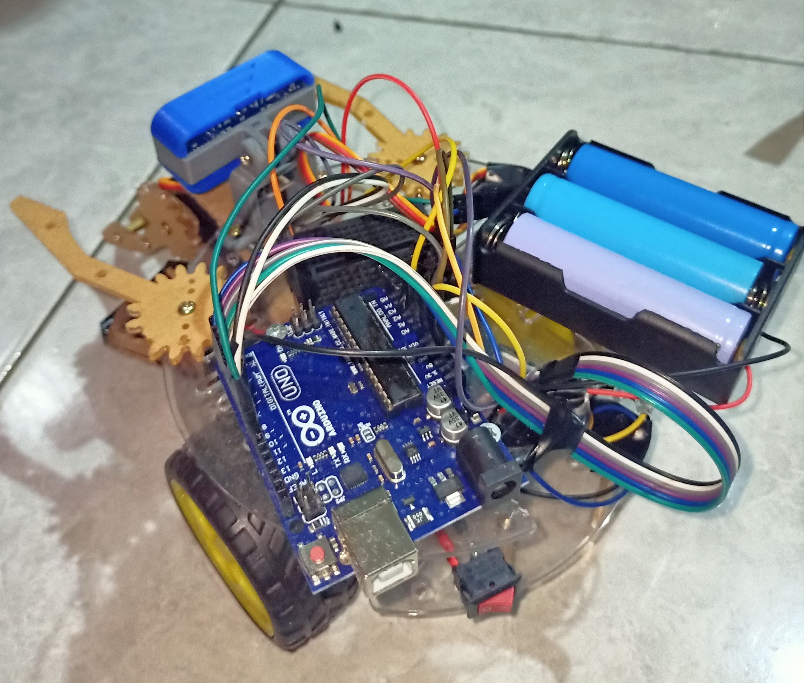
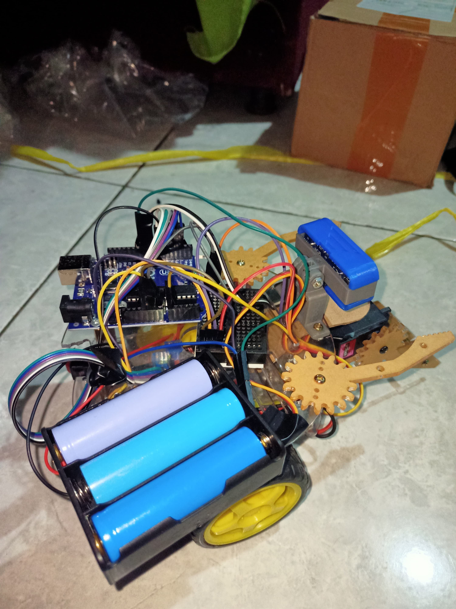
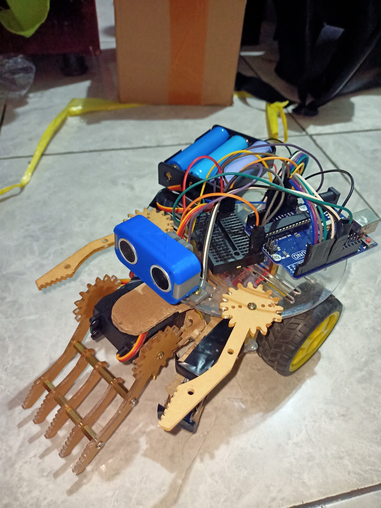

# Arduino Sumo Robot Project

This repository contains the source code and documentation for a simple Arduino-based sumo robot.

## 🤖 About the Robot
This sumo robot is designed to detect the opponent and push them outside the arena using IR sensors and basic attack logic.

### 🧠 Features
- Line detection using TCRT5000 sensors
- Motor control for turning and forward movement
- **Servo-powered arm to lift opponents**

## 🔧 Hardware Components
- Arduino Uno
- L298N Motor Driver
- 2x DC Motors
- 3x IR Sensors
- Battery pack
- Robot chassis

## 💻 Source Code
The code is located in the `/code/` folder:  
➡️ `Robot_sumo.ino`

## 📸 Photos
Photos of the robot are available in the `/images/` folder.

## 📦 How to Use
1. Upload the `.ino` file to your Arduino board
2. Assemble the robot according to the wiring
3. Place the robot in a sumo arena and power it on

## 📜 License
This project is open-source and free to use.

### 📸 Robot Preview

Berikut adalah beberapa tampilan dari robot sumo yang dibuat:

#### 🔹 Tampak Depan

#### 🔹 Tampak Samping

#### 🔹 Tampak Atas

#### 🔹 Tampak Keseluruhan

